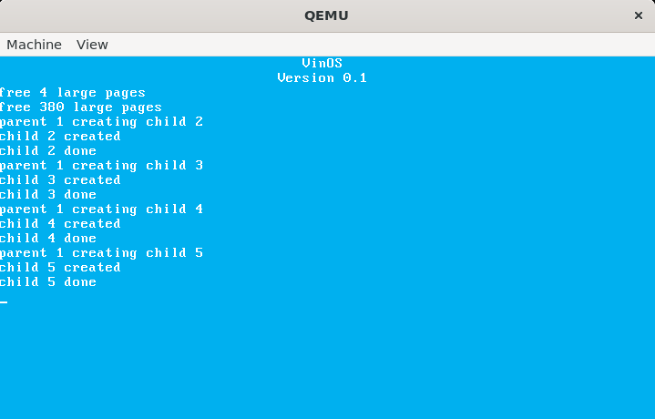

# VinOS

VinOS is an operating system built from scratch for the x86-64 architecture, 
developed as a hands-on project to explore the internals of UNIX-like operating
systems and low-level x86-64 programming. The long-term goal is to create a minimal
operating system capable of running a few simple games.

## Features

### **Core System**
- **Custom Bootloader** - Handles transition from 16-bit real mode to 64-bit long mode.
- **VGA Text Mode** - Provides a basic console output via direct VGA buffer manipulation.
- **Physical Memory Allocator** - Implements 'kalloc()', 'kfree()' using the buddy algorithm.
- **5-Level Paging** - Supports the modern x86-64 paging hierarchy.
- **Simple Process Management** - Implements 'fork()' with copy-on-write, 'exit()', 'wait()' system calls.
- **Process Scheduler** - Priority-based preemptive scheduler.

### ***Screenshots***

### **Technical Stack**
- **Languages**: C (kernel), AT&T Assembly (bootloader)
- **Architecture**: x86-64
- **Tools**: Makefile, elf-gcc, QEMU

## Building and Running

*To be added*

## License

*To be added*
